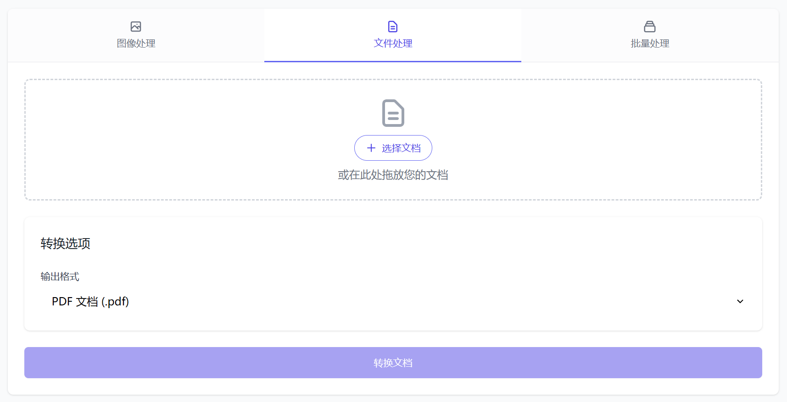
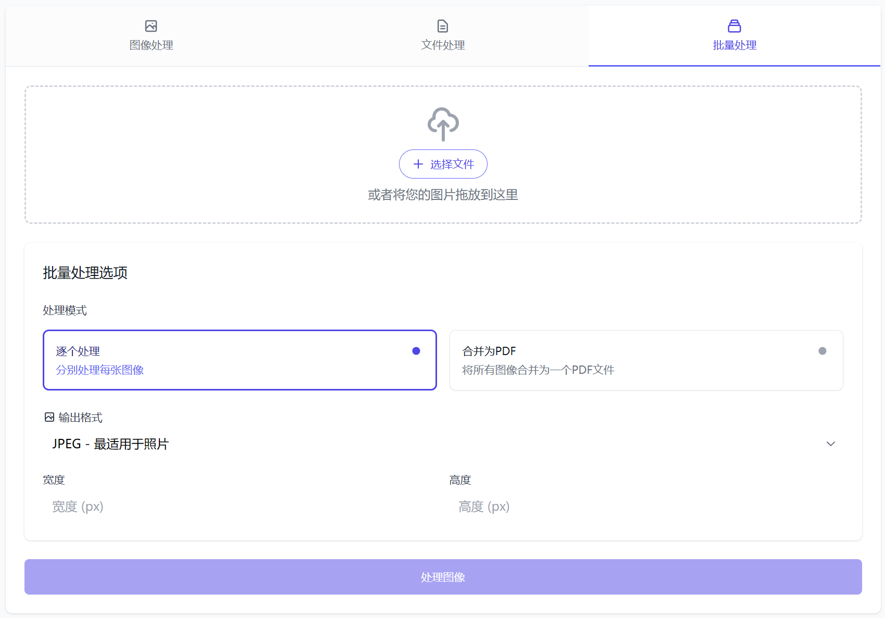

# Reubah - 全能文件转换器 & 图像处理器

一个简单易用的基于网页的工具，用于处理图像和转换文档，配有简洁的界面。

## 快速开始

### 使用 Docker
```bash
git clone https://github.com/dendianugerah/reubah.git
cd reubah
docker-compose up -d
```
或为项目创建一个文件夹并运行
```bash
docker run -d --name reubah -p 8081:8081 -v $(pwd)/tmp:/app/tmp -v doc-temp:/tmp -e PORT=8081 --restart unless-stopped ghcr.io/dendianugerah/reubah:latest
```
浏览器打开: `http://localhost:8081`

### 本地开发
要求:
- Go 1.22+
- LibreOffice (文档转换的要求)
- GCC/G++

```bash
go mod download
go run cmd/server/main.go
```

## 效果图

以下是与项目相关的一些图像





## 格式转换矩阵

> **矩阵指南:**
> - 在左列中找到您的源格式
> - 沿行查找可用的输出格式
> - ✅ = 支持的转换
> - `-` =  相同格式（无需转换）

### I图像转换矩阵

| 从 ➡️ 到 ⬇️ | JPG | PNG | WebP | GIF | BMP | PDF |
|--------------|:---:|:---:|:----:|:---:|:---:|:---:|
| **JPG**      | -   | ✅  | ✅   | ✅  | ✅  | ✅  |
| **PNG**      | ✅  | -   | ✅   | ✅  | ✅  | ✅  |
| **WebP**     | ✅  | ✅  | -    | ✅  | ✅  | ✅  |
| **GIF**      | ✅  | ✅  | ✅   | -   | ✅  | ✅  |
| **BMP**      | ✅  | ✅  | ✅   | ✅  | -   | ✅  |

### 文档转换矩阵

| 从 ➡️ 到 ⬇️ | PDF | DOCX | DOC | ODT | RTF | TXT |
|--------------|:---:|:----:|:---:|:---:|:---:|:---:|
| **PDF** (从 PDF 当前转换效果仍不佳)     | -   | ✅   | ✅  | ❌  | ❌  | ❌  |
| **DOCX**     | ✅  | -    | ✅  | ✅  | ✅  | ✅  |
| **DOC**      | ✅  | ✅   | -   | ✅  | ✅  | ✅  |
| **ODT**      | ✅  | ✅   | ✅  | -   | ✅  | ✅  |
| **RTF**      | ✅  | ✅   | ✅  | ✅  | -   | ✅  |
| **TXT**      | ✅  | ✅   | ✅  | ✅  | ✅  | -   |

### 额外的图像功能

| 格式 | 背景移除 (即将推出) | 优化 | 批量处理 |
|------|:-----------------:|:----:|:--------:|
| JPG  | ❌                | ✅  | ✅       |
| PNG  | ❌                | ❌  | ✅       |
| WebP | ❌                | ❌  | ✅       |
| GIF  | ❌                | ❌  | ✅       |
| BMP  | ❌                | ❌  | ✅       |

## 注意事项

- 隔离的处理环境：每个文件在独立的环境中进行处理，确保安全性和稳定性。
- 无文件存储 - 立即交付：处理完成后，文件会立即发送给用户，系统中不留存任何副本。
- 自动清理：处理完成后，临时文件和数据会被自动删除，以保护用户隐私和释放资源。
- 输入验证：系统会对上传的文件进行验证，确保只处理符合要求的文件格式和大小。

## 许可证
本项目采用 MIT许可证 进行授权。